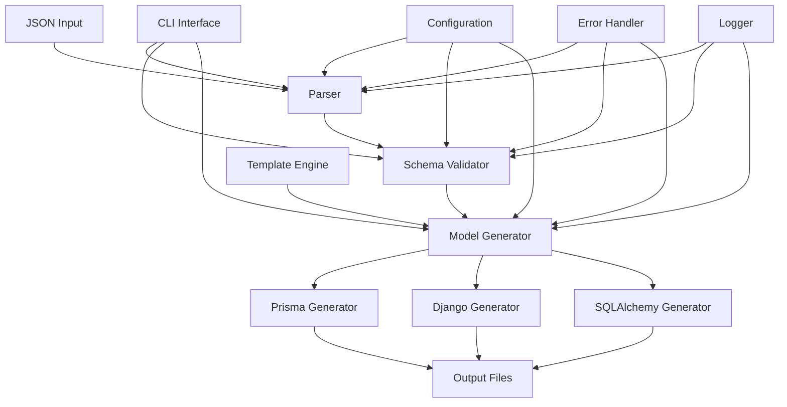

# JSON-to-ORM: CLI-утилита для генерации ORM моделей

## Обзор проекта

**JSON-to-ORM** - это CLI-утилита, которая автоматически генерирует модели для популярных ORM фреймворков (Prisma, Django, SQLAlchemy) на основе JSON-схемы данных. Утилита предназначена для ускорения процесса разработки путем автоматизации создания моделей данных.

## Цели проекта

### Основные цели
- Автоматизация создания ORM моделей из JSON-схем
- Поддержка множественных ORM фреймворков
- Обеспечение консистентности между схемой данных и моделями
- Ускорение процесса разработки

### Технические цели
- Высокая производительность обработки больших JSON-файлов
- Расширяемость для поддержки новых ORM фреймворков
- Надежная валидация входных данных
- Подробное логирование и обработка ошибок

## Архитектура системы

### Общая архитектура



### Принятые архитектурные решения

#### 1. Формат JSON-схемы
- **Решение**: Кастомный формат с таблицами и полями
- **Структура**: 
  - `tables` - массив таблиц
  - `relationships` - массив связей между таблицами
  - Поддержка базовых и сложных типов данных
  - Явное определение связей

#### 2. Стратегия генерации
- **Решение**: Стратегия паттерн с базовым классом
- **Архитектура**:
  - Абстрактный базовый класс `BaseGenerator`
  - Конкретные реализации для каждого ORM
  - Единый интерфейс и общая логика
  - Плагинная архитектура для расширяемости

#### 3. Обработка ошибок
- **Решение**: Многоуровневая система обработки ошибок
- **Подход**:
  - Исключения с детальными сообщениями
  - Структурированные ошибки в JSON формате
  - Логирование всех ошибок
  - Graceful degradation при некритичных ошибках

#### 4. Валидация
- **Решение**: Трехуровневая система валидации
- **Уровни**:
  - Синтаксическая валидация JSON
  - Семантическая валидация схемы
  - Валидация совместимости с целевым ORM

### Компоненты системы

#### 1. Parser Module
- **Назначение**: Парсинг и валидация JSON-файлов
- **Входные данные**: JSON-файл со схемой данных
- **Выходные данные**: Структурированное представление схемы
- **Зависимости**: JSON Schema validation library
- **Особенности**: Потоковая обработка больших файлов

#### 2. Schema Validator
- **Назначение**: Валидация корректности схемы данных
- **Функции**: Проверка типов данных, связей, ограничений
- **Выходные данные**: Валидированная схема или ошибки валидации
- **Особенности**: Трехуровневая валидация с детальными сообщениями

#### 3. Model Generator
- **Назначение**: Генерация моделей для различных ORM
- **Стратегии**: 
  - Prisma Schema Generator
  - Django Models Generator
  - SQLAlchemy Models Generator
- **Выходные данные**: Файлы моделей в соответствующих форматах
- **Особенности**: Jinja2 шаблоны, кэширование, плагинная архитектура

#### 4. CLI Interface
- **Назначение**: Пользовательский интерфейс
- **Команды**: 
  - `generate` - основная команда генерации
  - `validate` - валидация JSON-схемы
  - `list-formats` - список поддерживаемых форматов
  - `convert` - конвертация между форматами
  - `info` - информация о схеме
  - `test` - тестирование генерации
- **Особенности**: Rich для красивого вывода, подробные опции

#### 5. Template Engine
- **Назначение**: Генерация кода на основе шаблонов
- **Технология**: Jinja2
- **Особенности**: Кэширование шаблонов, наследование, кастомизация

#### 6. Error Handler
- **Назначение**: Централизованная обработка ошибок
- **Функции**: Структурированные ошибки, логирование, восстановление
- **Особенности**: JSON формат ошибок, контекстная информация

#### 7. Logger
- **Назначение**: Система логирования операций
- **Функции**: Структурированные логи, различные уровни, ротация
- **Особенности**: JSON формат логов, отправка критических ошибок

## Технологический стек

### Основные технологии
- **Язык программирования**: Python 3.8+
- **CLI Framework**: Click или Typer
- **JSON Processing**: jsonschema, pydantic
- **Template Engine**: Jinja2
- **Testing**: pytest, pytest-cov

### Зависимости
```python
# Основные зависимости
click>=8.0.0
jsonschema>=4.0.0
pydantic>=2.0.0
jinja2>=3.0.0

# Разработка и тестирование
pytest>=7.0.0
pytest-cov>=4.0.0
black>=22.0.0
flake8>=5.0.0
mypy>=1.0.0
```

## Структура проекта

```
json-to-orm/
├── src/
│   ├── __init__.py
│   ├── cli.py              # CLI интерфейс
│   ├── parser/             # Модуль парсинга
│   │   ├── __init__.py
│   │   ├── json_parser.py
│   │   └── validator.py
│   ├── generators/         # Генераторы моделей
│   │   ├── __init__.py
│   │   ├── base.py
│   │   ├── prisma.py
│   │   ├── django.py
│   │   └── sqlalchemy.py
│   ├── templates/          # Шаблоны для генерации
│   │   ├── prisma/
│   │   ├── django/
│   │   └── sqlalchemy/
│   └── utils/              # Утилиты
│       ├── __init__.py
│       ├── logger.py
│       └── helpers.py
├── tests/                  # Тесты
│   ├── __init__.py
│   ├── test_parser.py
│   ├── test_generators.py
│   └── test_cli.py
├── docs/                   # Документация
├── examples/               # Примеры использования
├── pyproject.toml          # Конфигурация проекта
├── README.md
└── .gitignore
```

## Этапы разработки

### Этап 1: Базовая инфраструктура (Недели 1-2)
- [ ] Настройка проекта и зависимостей
- [ ] Создание CLI интерфейса
- [ ] Базовая структура парсера JSON
- [ ] Система логирования

### Этап 2: Парсинг и валидация (Недели 3-4)
- [ ] Реализация JSON парсера
- [ ] Валидация схемы данных
- [ ] Обработка ошибок
- [ ] Тесты для парсера

### Этап 3: Генераторы моделей (Недели 5-8)
- [ ] Базовый класс генератора
- [ ] Генератор Prisma моделей
- [ ] Генератор Django моделей
- [ ] Генератор SQLAlchemy моделей
- [ ] Тесты для генераторов

### Этап 4: Интеграция и оптимизация (Недели 9-10)
- [ ] Интеграция всех компонентов
- [ ] Оптимизация производительности
- [ ] Документация API
- [ ] Примеры использования

### Этап 5: Тестирование и релиз (Недели 11-12)
- [ ] Интеграционные тесты
- [ ] Исправление багов
- [ ] Подготовка к релизу
- [ ] Создание документации пользователя

## Стандарты и принципы

### Принципы разработки
- **SOLID**: Следование принципам SOLID
- **DRY**: Избежание дублирования кода
- **KISS**: Простота и читаемость кода
- **Separation of Concerns**: Разделение ответственности

### Стандарты кодирования
- **PEP 8**: Стиль кода Python
- **Type Hints**: Аннотации типов
- **Docstrings**: Документирование функций и классов
- **Error Handling**: Единообразная обработка ошибок

### Качество кода
- **Code Coverage**: Минимум 90% покрытия тестами
- **Static Analysis**: Использование mypy и flake8
- **Code Formatting**: Black для форматирования
- **Pre-commit Hooks**: Автоматическая проверка качества

## API и интерфейсы

### CLI Interface
```bash
# Основная команда генерации
json-to-orm generate --input schema.json --output models/ --format prisma

# Валидация схемы
json-to-orm validate --input schema.json

# Список поддерживаемых форматов
json-to-orm list-formats
```

### Programmatic API
```python
from json_to_orm import JSONToORM

# Создание экземпляра
converter = JSONToORM()

# Генерация моделей
converter.generate(
    input_file="schema.json",
    output_dir="models/",
    format="prisma"
)
```

## Формат JSON-схемы

### Пример схемы
```json
{
  "tables": [
    {
      "name": "users",
      "fields": [
        {
          "name": "id",
          "type": "integer",
          "primary_key": true,
          "auto_increment": true
        },
        {
          "name": "email",
          "type": "string",
          "unique": true,
          "nullable": false
        },
        {
          "name": "created_at",
          "type": "datetime",
          "default": "now()"
        }
      ]
    }
  ],
  "relationships": [
    {
      "from": "users",
      "to": "posts",
      "type": "one_to_many",
      "foreign_key": "user_id"
    }
  ]
}
```

## Безопасность

### Принципы безопасности
- Валидация всех входных данных
- Безопасная обработка файлов
- Логирование подозрительной активности
- Ограничение доступа к файловой системе

### Обработка ошибок
- Детальные сообщения об ошибках
- Graceful degradation
- Восстановление после ошибок
- Логирование всех ошибок

## Производительность

### Оптимизации
- Ленивая загрузка компонентов
- Кэширование шаблонов
- Потоковая обработка больших файлов
- Асинхронная генерация при необходимости

### Метрики производительности
- Время обработки файлов различного размера
- Использование памяти
- Время генерации моделей
- Время валидации схем

## Мониторинг и логирование

### Система логирования
- Структурированные логи в JSON формате
- Различные уровни логирования (DEBUG, INFO, WARNING, ERROR)
- Ротация логов
- Отправка критических ошибок

### Метрики
- Количество обработанных файлов
- Время выполнения операций
- Частота ошибок
- Популярность различных форматов

## Планы развития

### Краткосрочные планы (3-6 месяцев)
- Поддержка дополнительных ORM фреймворков
- Улучшение валидации схем
- Добавление интерактивного режима
- Интеграция с IDE

### Долгосрочные планы (6-12 месяцев)
- Веб-интерфейс для генерации
- Поддержка миграций
- Интеграция с системами контроля версий
- Плагинная архитектура

## Конкурентный анализ

### Похожие проекты
- **[SchemaBloom](https://github.com/11123aa/SchemaBloom.git)** - наш Git репозиторий для проекта
- Другие инструменты генерации кода из схем

### Уникальные преимущества JSON-to-ORM
- Специализация на ORM фреймворках (Prisma, Django, SQLAlchemy)
- Простой и понятный JSON формат схемы
- CLI интерфейс для автоматизации
- Плагинная архитектура для расширяемости

## Приватность и безопасность

### Политика приватности
1. **Внутренняя документация** - вся документация в папке `docs/` остается приватной
2. **Git репозиторий** - содержит только публичный код и базовую информацию
3. **Процесс разработки** - детали разработки с ИИ не раскрываются публично
4. **Архитектурные решения** - внутренние решения остаются конфиденциальными

### Публичная информация
- Базовое описание функциональности
- Инструкции по установке и использованию
- Примеры кода и схем
- Ссылки на репозиторий

### Приватная информация
- Детали архитектуры и планирования
- Процесс разработки и управления задачами
- Внутренние решения и обоснования
- Прогресс разработки и метрики

## Заключение

JSON-to-ORM представляет собой мощный инструмент для автоматизации создания ORM моделей, который значительно ускорит процесс разработки и обеспечит консистентность между схемой данных и моделями. Проект следует современным принципам разработки программного обеспечения и готов к масштабированию и расширению функциональности. 